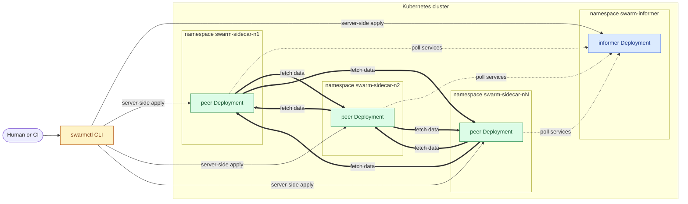
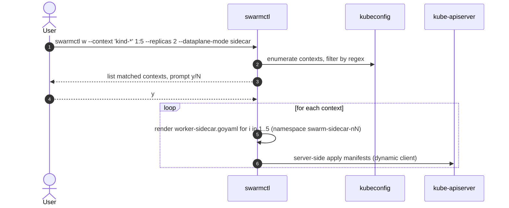
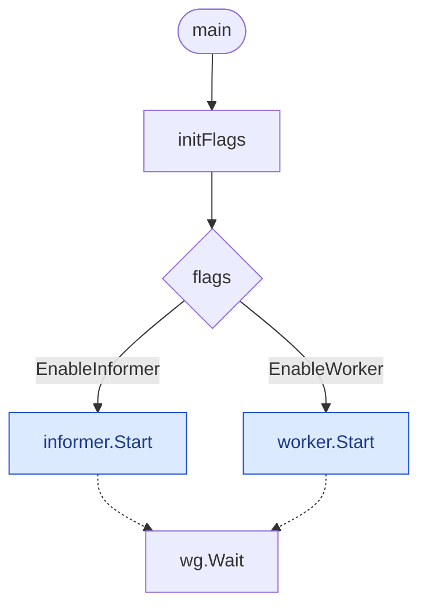
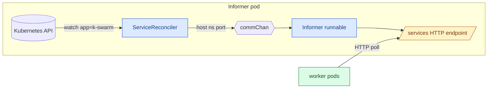
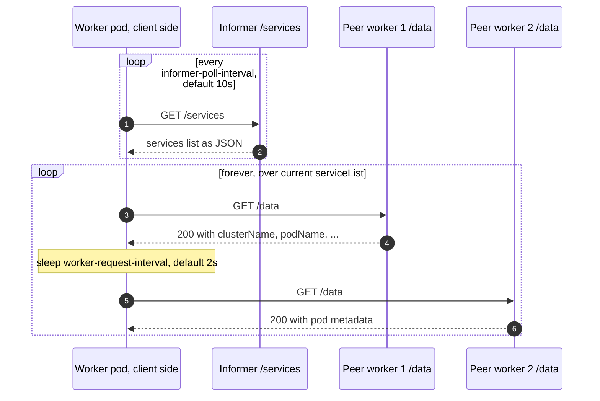
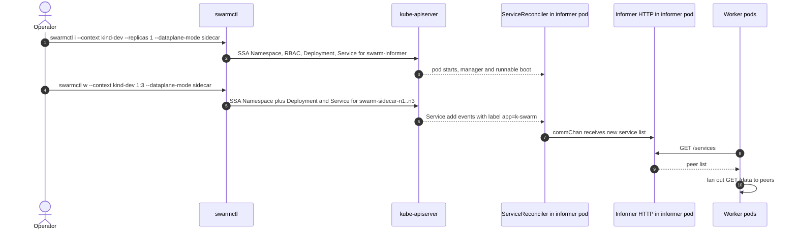

# k-swarm Architecture

This document is the entry point for new contributors who need to understand how
`k-swarm` is structured and how its pieces fit together. It complements the
top-level [README.md](../README.md) (which focuses on usage).

## 1. What problem does k-swarm solve?

`k-swarm` deploys a cooperating set of Kubernetes workloads that automatically
discover each other and exchange synthetic HTTP traffic. The resulting traffic
mesh is used as a foundation for service-mesh experiments — for example,
validating Istio sidecar vs. ambient configurations, multi-cluster failover, or
telemetry pipelines at scale.

The design optimizes for two things:

- **Easy fan-out across many clusters and namespaces**, driven by a single
  command-line tool.
- **Self-organizing traffic**: once deployed, workers discover their peers and
  start talking with no further input.

## 2. High-level component map

`k-swarm` ships **two binaries** built from this repository:

| Binary      | Source                                  | Distribution                | Audience               |
| ----------- | --------------------------------------- | --------------------------- | ---------------------- |
| `swarmctl`  | [cmd/swarmctl/main.go](../cmd/swarmctl/main.go) | Homebrew / Go binary | Humans, CI, automation |
| `manager`   | [cmd/main.go](../cmd/main.go)           | Container image (`ghcr.io/h0tbird/k-swarm`) | Runs inside the cluster |

The `manager` binary is a single image that can run in **two distinct roles**
selected by command-line flags:

- `--enable-informer` — runs the **informer** (one Deployment per cluster)
- `--enable-worker`  — runs the **worker**   (many Deployments per cluster)



## 3. The `swarmctl` CLI

`swarmctl` is a thin Cobra-based CLI whose only job is to **render Go templates
into Kubernetes manifests and server-side apply them** against a fan-out of
contexts selected by a regex.

Key packages:

- [cmd/swarmctl/cmd/cmd.go](../cmd/swarmctl/cmd/cmd.go) — wires the Cobra
  command tree and flags.
- [cmd/swarmctl/pkg/swarmctl/swarmctl.go](../cmd/swarmctl/pkg/swarmctl/swarmctl.go) —
  `Install*` handlers; renders templates and drives the apply
  loop.
- [cmd/swarmctl/pkg/k8sctx/k8sctx.go](../cmd/swarmctl/pkg/k8sctx/k8sctx.go) —
  per-kubeconfig-context wrapper holding a REST config plus discovery and
  dynamic clients (used for SSA).
- [cmd/swarmctl/assets/](../cmd/swarmctl/assets/) — embedded `*.goyaml`
  templates: `informer-common.goyaml`, `informer-sidecar.goyaml`,
  `informer-ambient.goyaml`, `worker-common.goyaml`, `worker-sidecar.goyaml`,
  `worker-ambient.goyaml` and `telemetry.goyaml`. The `-common.goyaml` files
  hold resources shared by both dataplane modes (RBAC, certificates, ingress
  Gateways/VirtualServices/HTTPRoutes); the `-sidecar` / `-ambient` files
  hold only the manifests specific to one Istio dataplane mode.
- [cmd/swarmctl/pkg/profiling/](../cmd/swarmctl/pkg/profiling/) — opt-in CPU,
  memory and trace profiling toggled by global `--cpu-profile`,
  `--mem-profile` and `--tracing` flags. The output paths default to
  `cpu.prof`, `mem.prof` and `trace.out` and can be overridden with
  `--cpu-profile-file`, `--mem-profile-file` and `--tracing-file`.

### Command tree

```
swarmctl
├── dump (d)                              # write every embedded template to ~/.swarmctl
├── delete (rm)                           # delete everything swarmctl has installed
├── informer (i)                          # render + server-side apply the informer
│   └── telemetry (t) on|off              # toggle informer telemetry overlay
└── worker (w) <start:end>                # render + server-side apply N workers
    └── telemetry (t) <start:end> on|off  # toggle worker telemetry overlay
```

`delete` accepts only `--context`, `--yes` and `--dry-run`; it discovers the
swarm namespaces in each matching cluster (those prefixed with `swarm-`) and
removes them along with the cluster-scoped RBAC bindings created for the
informer.

Both `informer` and `worker` accept `--context '<regex>'`; matching kubeconfig
contexts are discovered, the user is prompted (unless `--yes`), and the
rendered manifests are server-side applied to **every** matching cluster. Pass
`--dry-run` to render manifests to stdout without contacting any cluster.

Key persistent flags shared by `informer` and `worker` (and inherited by their
`telemetry` subcommands):

| Flag | Default | Purpose |
| ---- | ------- | ------- |
| `--dataplane-mode` | _(required)_ | `sidecar` or `ambient`. Drives namespace labels, sidecar/waypoint wiring, and which Istio resources are emitted. |
| `--context` | _empty_ | Regex matched against kubeconfig context names. Empty matches none. |
| `--replicas` | `1` | Replica count per Deployment. |
| `--image-tag` | _empty_ | Override the manager image tag (defaults to the swarmctl version). |
| `--istio-revision` | _empty_ | Sets `istio.io/rev` on the namespace and disables default injection when in sidecar mode. |
| `--cluster-domain` | _auto_ | Cluster DNS suffix; auto-detected from CoreDNS, falls back to `cluster.local` in `--dry-run`. |
| `--node-selector` | _empty_ | Inline YAML node selector for the Deployment pod spec. |
| `--waypoint-name` | `waypoint` | Name of the per-namespace ambient waypoint Gateway. |
| `--ingress-mode` | `none` | `none`, `shared` (Istio `Gateway`/`VirtualService` selecting `istio: nsgw`) or `dedicated` (per-namespace Gateway API `Gateway`/`HTTPRoute`). |
| `--multi-cluster` | `false` | Ambient-only: labels peer and waypoint Services with `istio.io/global=true` and emits a `DestinationRule` with locality failover by `topology.istio.io/cluster`. |
| `--log-responses` | `false` | Renders the worker manifest with `--worker-log-responses`, causing each pod to log raw JSON bodies received from the informer and peers. |
| `--dry-run` | `false` | Render YAML to stdout; skip cluster discovery and apply. |
| `--yes` | `false` | Skip the confirmation prompt before applying. |

### Typical flow



The `worker` subcommand takes a numeric range (`<start:end>`); for each `i` it
renders the worker template into namespace `swarm-<dataplane-mode>-n<i>` (e.g.
`swarm-sidecar-n1`, `swarm-ambient-n3`). This is how a single `swarmctl w 1:5` produces
five Deployments / Services across five namespaces.

The rendered `worker-<mode>.goyaml` is more than just a Deployment + Service. Per
namespace it can emit, depending on flags:

- Always: `Namespace`, peer `Service`, peer `Deployment`,
  `AuthorizationPolicy` allowing `GET /data`, and a cert-manager `Certificate`
  (replicated to `istio-system` for ingress TLS).
- Sidecar mode (`--dataplane-mode sidecar`): a `DestinationRule` with locality
  load balancing and outlier detection plus a `STRICT` mTLS
  `PeerAuthentication`.
- Ambient mode (`--dataplane-mode ambient`): a per-namespace waypoint
  `Gateway` (`gatewayClassName: istio-waypoint`); the peer Service is
  labeled `istio.io/use-waypoint`.
- Ambient + `--multi-cluster`: peer and waypoint Services are labeled
  `istio.io/global=true` and an extra `DestinationRule` with locality
  failover by `topology.istio.io/cluster` is emitted.
- `--ingress-mode shared`: an Istio `Gateway`/`VirtualService` pair selecting
  the shared `istio: nsgw` workload.
- `--ingress-mode dedicated`: a Gateway API `Gateway`/`HTTPRoute` pair with
  `gatewayClassName: istio`.

## 4. The `manager` binary

[cmd/main.go](../cmd/main.go) is a deliberately small entry point:



The two roles do not share state; they are simply gated by independent
booleans, and both can technically run in the same process (tests do this).

## 5. The informer

Source: [pkg/informer/informer.go](../pkg/informer/informer.go) and the
controller in [internal/controller/service_controller.go](../internal/controller/service_controller.go).

There is **one informer Deployment per cluster**, in the `swarm-informer` namespace.
Internally it runs two cooperating components inside a single
`controller-runtime` manager:

1. A **Kubebuilder controller** (`ServiceReconciler`) that watches
   `core/v1/Service` objects labeled `app=k-swarm`.
2. A **Gin HTTP server** (`Informer` runnable) that exposes `GET /services`.

They are stitched together by an unbuffered `chan []string`:



Notable details:

- The reconciler filters with a `predicate.NewPredicateFuncs` that only admits
  objects bearing `app=k-swarm`, so reconcile is noisy only on relevant
  Services.
- On every reconcile it `List()`s **all** matching Services and rebuilds the
  full set; entries are formatted as `<name>.<namespace>:<port>` for the
  Service port named `http`.
- The HTTP server is `endless`-based so the process can hot-reload without
  dropping connections.
- The endpoint is intentionally trivial (no auth, no pagination) because it
  lives entirely behind cluster-internal networking.

## 6. The worker

Source: [pkg/worker/worker.go](../pkg/worker/worker.go).

The `worker` is the in-pod process; its Deployment and Service are rendered
under the name `peer` in each `swarm-<dataplane-mode>-n<i>` namespace. A worker pod
is **simultaneously a client and a server**:

- **Server** (`server`): a Gin handler at `GET /data` that returns a small JSON
  blob describing the pod (`CLUSTER_NAME`, `POD_NAME`, `POD_NAMESPACE`,
  `POD_IP`, `NODE_NAME`, all from the downward API).
- **Client** (`client`): periodically polls the informer for the current peer
  list, then in a tight loop issues `GET /data` against every peer, sleeping
  `--worker-request-interval` between requests.



The polling goroutine and the request goroutine share the package-level
`serviceList` slice; the polling goroutine atomically replaces it after each
successful fetch. This is intentional: a worker that briefly cannot reach the
informer keeps using the last known peer set.

Workers are deployed **once per namespace**, with multiple replicas inside each
namespace. A typical lab might have:

- `swarm-informer/`               — 1 Deployment, N replicas (HA via leader election)
- `swarm-sidecar-n1/` … `swarm-sidecar-n5/` — one worker Deployment each, R replicas

This namespace-per-service shape is what makes the synthetic mesh useful for
mesh experiments: each namespace can carry different Istio
revisions/dataplane modes/telemetry knobs, all driven by `swarmctl` flags.

## 7. End-to-end: what happens when an operator runs `swarmctl`



## 8. Where to look next

- **Add a CLI flag / template knob** → start in
  [cmd/swarmctl/cmd/cmd.go](../cmd/swarmctl/cmd/cmd.go) (register the flag),
  then plumb it through the `Install*` handler in
  [cmd/swarmctl/pkg/swarmctl/swarmctl.go](../cmd/swarmctl/pkg/swarmctl/swarmctl.go),
  and finally consume it in the matching template under
  [cmd/swarmctl/assets/](../cmd/swarmctl/assets/).
- **Change discovery semantics** → edit the predicate / list logic in
  [internal/controller/service_controller.go](../internal/controller/service_controller.go).
- **Change the synthetic traffic pattern** → edit `client()` in
  [pkg/worker/worker.go](../pkg/worker/worker.go).
- **Add a new HTTP route** to the informer → register it in
  `Informer.Start()` in [pkg/informer/informer.go](../pkg/informer/informer.go).
- **Local end-to-end loop** → `make tilt-up` ([Tiltfile](../Tiltfile)).

## 9. Glossary

- **informer** — cluster-scoped discovery service that lists all swarm
  workers via a Kubebuilder controller and serves them at `GET /services`.
- **worker**   — namespace-scoped HTTP service that polls the informer and
  fans out `GET /data` requests to all discovered peers.
- **manager**  — the Go binary that, depending on flags, runs as informer,
  worker, or both. Shipped as a single container image.
- **swarmctl** — operator-facing CLI that renders embedded templates and
  server-side applies them across a regex-selected fan-out of kube contexts.
- **dataplane mode** — `sidecar` or `ambient`; required on every `informer` /
  `worker` invocation. Selects which Istio resources the templates emit and
  which namespace labels are applied.
- **ingress mode** — `none`, `shared` or `dedicated`; controls whether the
  worker manifest also emits Istio `Gateway`/`VirtualService` (shared) or
  Gateway API `Gateway`/`HTTPRoute` (dedicated) resources for the synthetic
  service.
- **multi-cluster** — ambient-only flag that promotes the worker and waypoint
  Services to global services (`istio.io/global=true`) and adds a locality
  failover `DestinationRule` keyed on `topology.istio.io/cluster`.
